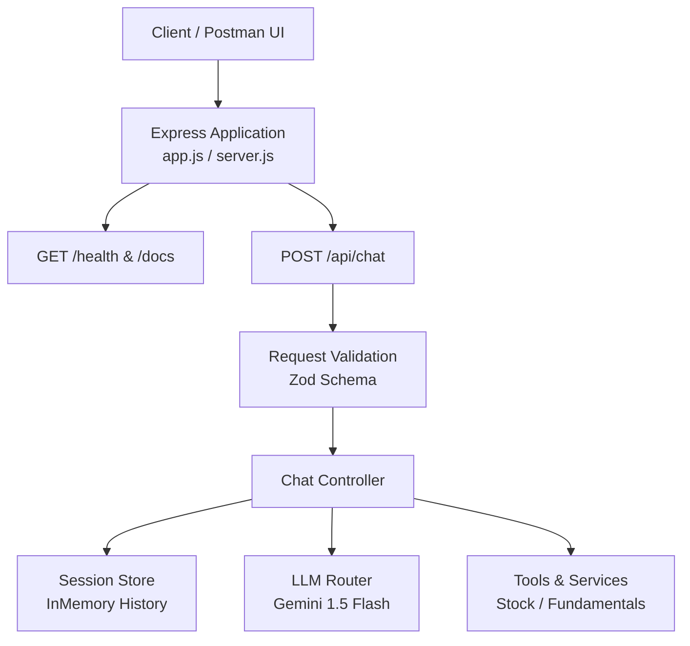

# Financial Support Assistant API

A Node.js and Express RESTful API powered by Google Gemini AI. The application processes user financial queries, dynamically routes intent (greetings, stock prices, fundamentals, or knowledge base lookups), retains multi-turn session context, and enforces a standardized JSON response envelope.

---

## Architecture Overview



---

## Features

* **LLM Intent Routing:** Classifies incoming user messages dynamically into `greeting`, `stock_price`, `fundamentals`, or `knowledge_base`.
* **Tool Execution:** Fetches real-time stock quotes, company fundamentals, or searches knowledge base documentation based on identified intent.
* **Context Preservation:** Retains conversation history on a per-`sessionId` basis to allow contextual follow-up queries.
* **Schema Validation:** Validates incoming payloads using Zod middleware prior to controller execution.
* **Standardized JSON Envelope:** Enforces a strict response structure (`{ "success": boolean, ... }`) across all endpoints, including application errors.

---

## Setup & Local Installation

### Prerequisites
* **Node.js** (v18 or higher)
* **npm** or **yarn**
* **Google Gemini API Key**

### 1. Clone the Repository
```bash
git clone [https://github.com/MojahidSayad/Financial-Assistant-API.git](https://github.com/MojahidSayad/Financial-Assistant-API.git)
cd Financial-Assistant-API

### 2. . Install Dependencies
'''bash
npm install

### 3. Configure Environment Variables
Create a .env file in the root directory:
PORT=3000
LLM_API_KEY=your_gemini_api_key_here
LLM_MODEL=gemini-1.5-flash

### 4. Start the Application
Bash
Development Mode (with nodemon)
npm run dev

Production Mode
npm start

### Environment Variables

| **Variable**  | **Description**                                                        | **Default**        |
| ------------- | ---------------------------------------------------------------------- | ------------------ |
| `PORT`        | The port for the Express server to listen on.                          | `3000`             |
| `LLM_API_KEY` | Google Gemini AI API key for intent classification and text synthesis. | Required           |
| `LLM_MODEL`   | Gemini AI model identifier.                                            | `gemini-1.5-flash` |


### API Documentation

Interactive Swagger documentation is available at **`http://localhost:3000/docs`**.

## Endpoints Summary

| **Method** | **Endpoint** | **Description** |
|---|---|---|
| `GET` | `/health` | Check server health and operational status. |
| `POST` | `/api/chat` | Process chat requests using context and intent processing. |
| `GET` | `/docs` | Open the interactive Swagger API documentation. |


### Example Requests & Responses
1. Health Check (GET /health)
Request:
GET http://localhost:3000/health

Response (200 OK):

JSON
{
  "status": "ok",
  "message": "Server is running!"
}
2. Stock Price Query (POST /api/chat)
Request Body:

JSON
{
  "sessionId": "postman-flow-101",
  "message": "What is the current stock price of TCS?"
}
Response (200 OK):

JSON
{
  "success": true,
  "sessionId": "postman-flow-101",
  "intent": "stock_price",
  "data": {
    "symbol": "TCS",
    "price": 4120.50,
    "currency": "INR"
  },
  "response": "The current market price of Tata Consultancy Services (TCS) is ₹4,120.50."
}
3. Missing Body Parameter (POST /api/chat)
Request Body:

JSON
{
  "sessionId": "postman-flow-101"
}
Response (400 Bad Request):

JSON
{
  "success": false,
  "error": {
    "code": "INVALID_INPUT",
    "message": "message is required and cannot be empty."
  }
}


### Design Decisions
Modular Architecture: Express routing, input validation, intent logic, and response formatting are explicitly separated (/routes, /middleware, /controllers, /services).

Zod Middleware Validation: Ensures invalid payloads fail at the HTTP boundary before calling external LLM APIs.

JSON Output Standardization: Enforces structured output formatting ({ success, data, error }) globally via centralized error-handling middleware.

Known Limitations
In-Memory Session Store: Session state and conversation history are stored in memory and reset upon server restart.

Mocked Tool Integrations: Financial stock data and fundamental metrics rely on simulated values rather than live exchange APIs.

